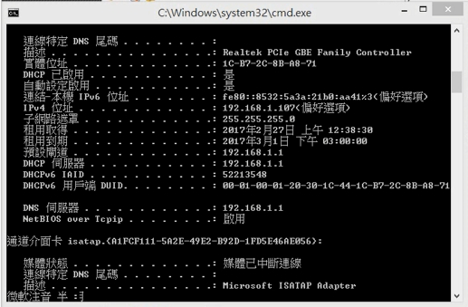

Title: 2017/2/22 W1
Date: 2017-02-22 11:00
Category: Course
Tags: w1上課內容
Slug: W1
Author: 40423228

##20170222W1上課內容

<!-- PELICAN_END_SUMMARY -->

一.可至<a href="http://mde.tw/2017springcd/blog/2017spring-cd.html">2017 Spring 協同產品設計實習</a>觀看這學期的課程大綱

二.了解如何使用stunnel

在按下start之後，會出現錯誤的圖案，
這是因為stunnel資料夾裡的config/styunnel.conf裡的ip與電腦的ip不同可至cmd打ipconfig/all的指令，找到電腦的ip位置並將其複製、貼到styunnel.conf裡
自己IP
修改IP(accept後面的IP)

三.開啟Leo
利用Scite編輯Start.bat

四.利用python程式碼控制Vrep裡的單連桿作動。

可至<a href="http://github.com/mdecourse/2017springcd">課程倉儲</a>的data裡下載fourbar_eightbar_solvespace_vrep.7z以及onelink_vrep_remoteapi_pos_vel.7z並解壓縮，裡面有單連桿、四連桿及八連桿三個檔案，可試著在solvespace及Vrep裡開啟。

在Vrep裡開啟one_link_robot_remoteAPI.ttt的檔案(ttt是Vrep檔案的副檔名)，在SciTE裡開啟one_link_robot_remoteAPI_joint_target_vel.py的檔案，按下Tool裡的Go即可開始控制單連桿，按Enter會旋轉，按P會暫停。

##第一週影片

<iframe src="https://player.vimeo.com/video/206084321" width="640" height="360" frameborder="0" webkitallowfullscreen mozallowfullscreen allowfullscreen></iframe>

<a href="https://vimeo.com/206084321">stunnel設定</a> from <a href="https://vimeo.com/user47600730">40423228</a> on <a href="https://vimeo.com">Vimeo</a>.

40423228機械設計工程系-協同產品設計實習課程-W1</a> from <a href="https://vimeo.com/user47600730/videos">40423228</a> on <a href="https://vimeo.com/home/myvideos">vimeo</a>.

