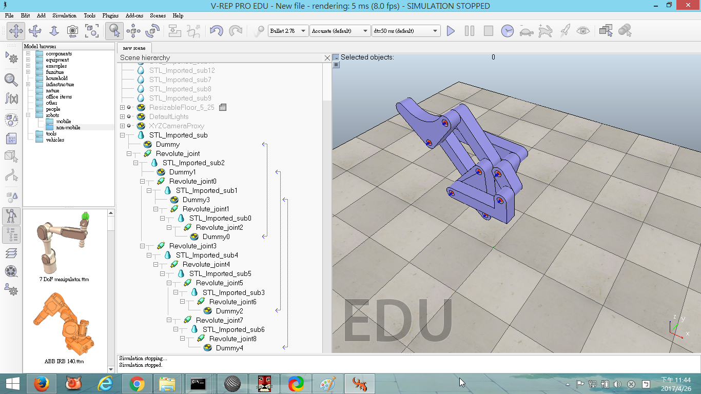

Title: 2017/04/05 W7
Date: 2017-04-05 11:00
Category: Course
Tags: w7上課內容
Slug: W7
Author: 40423228

###20170405W7上課內容

一.利用fossil對倉儲進行管理

二.利用Onshape繪製八連桿

三.利用Vrep使八連桿作動

<!-- PELICAN_END_SUMMARY -->

##一.利用fossil對倉儲進行管理

對fossil管理的指令:
fossil clone uri foo.fossil

fossil open ./../../foo.fossil (開啟)

fossil add . 

fossil remote-url off (將自動推送改為手動，這是與git不同之處，fossil會自動推送)

fossil push https://user@192.168.X.XX (IP可用ipconfig/all找到)

##二.利用Onshape繪製八連桿

##三.利用Vrep使八連桿作動

影片:

#(1).零件

<iframe src="https://player.vimeo.com/video/212793254" width="640" height="359" frameborder="0" webkitallowfullscreen mozallowfullscreen allowfullscreen></iframe>

<a href="https://vimeo.com/212793254">20170405 part1</a> from <a href="https://vimeo.com/user47600730">40423228</a> on <a href="https://vimeo.com">Vimeo</a>.

#(2).零件

<iframe src="https://player.vimeo.com/video/212793288" width="640" height="359" frameborder="0" webkitallowfullscreen mozallowfullscreen allowfullscreen></iframe>

<a href="https://vimeo.com/212793288">20170405 part2</a> from <a href="https://vimeo.com/user47600730">40423228</a> on <a href="https://vimeo.com">Vimeo</a>.

#(3).組合

<iframe src="https://player.vimeo.com/video/212797143" width="640" height="359" frameborder="0" webkitallowfullscreen mozallowfullscreen allowfullscreen></iframe>

<a href="https://vimeo.com/212797143">20170405 part3</a> from <a href="https://vimeo.com/user47600730">40423228</a> on <a href="https://vimeo.com">Vimeo</a>.

#(4).組合

<iframe src="https://player.vimeo.com/video/212802593" width="640" height="359" frameborder="0" webkitallowfullscreen mozallowfullscreen allowfullscreen></iframe>

<a href="https://vimeo.com/212802593">20170405 part4</a> from <a href="https://vimeo.com/user47600730">40423228</a> on <a href="https://vimeo.com">Vimeo</a>.

#Vrep

<iframe src="https://player.vimeo.com/video/214865492" width="640" height="359" frameborder="0" webkitallowfullscreen mozallowfullscreen allowfullscreen></iframe>

<a href="https://vimeo.com/214865492">八連桿Vrep</a> from <a href="https://vimeo.com/user47600730">40423228</a> on <a href="https://vimeo.com">Vimeo</a>.

