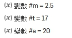
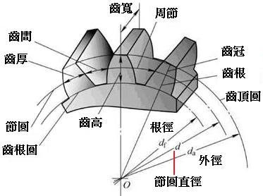
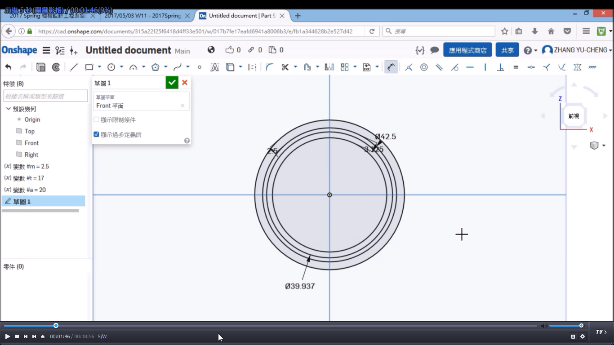
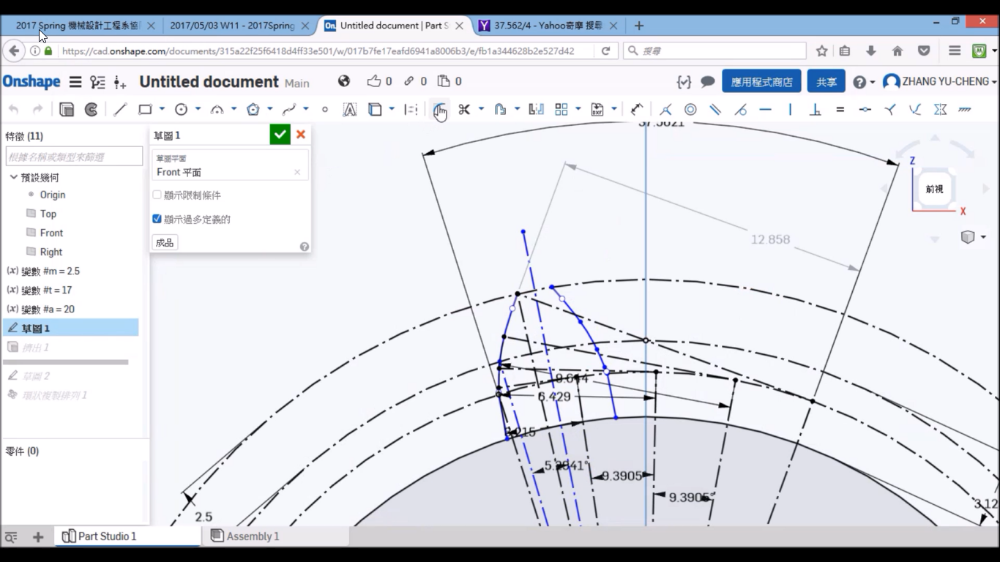
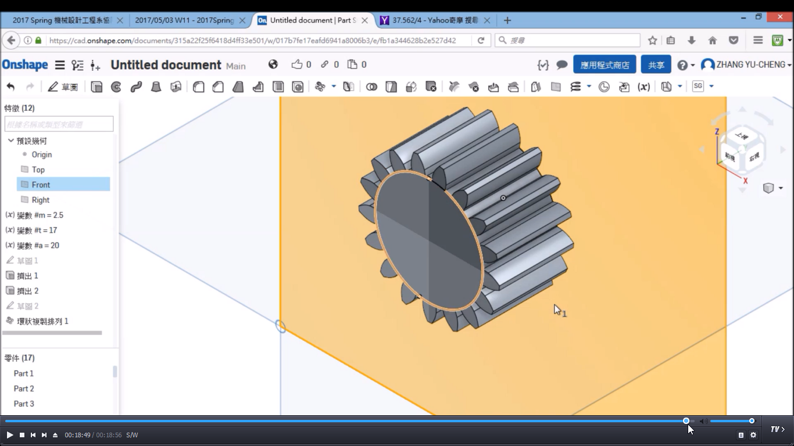

Title: 2017/05/10 W12
Date: 2017-05-10 11:00
Category: Course
Tags: w12上課內容
Slug: W12
Author: 40423228

###20170510W12

漸開線齒輪繪製

<!-- PELICAN_END_SUMMARY -->

設定變數

m=模數；t=齒數；a=壓力角

繪製節圓、齒頂圓、齒根圓、基圓

最後繪製完成

將齒環狀排列完成齒輪

#尺寸:

節圓 = MT

齒頂圓 = 節圓往外偏移M

齒底圓 = 節圓往內偏移M

基圓 = MTcos(a)

<a href=https://cad.onshape.com/documents/315a22f25f6418d4ff33e501/w/017b7fe17eafd6941a8006b3/e/fb1a344628b2e527d42bb815">Onshape</a>

<iframe src="https://player.vimeo.com/video/218664256" width="640" height="360" frameborder="0" webkitallowfullscreen mozallowfullscreen allowfullscreen></iframe>

<a href="https://vimeo.com/218664256">漸開線齒輪T17</a> from <a href="https://vimeo.com/user47600730">40423228</a> on <a href="https://vimeo.com">Vimeo</a>.

