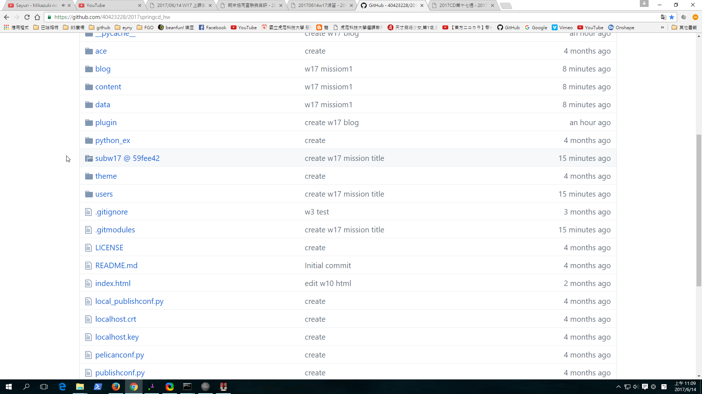

Title: 20170614w17練習
Date: 2017-06-14 11:00
Category: Course
Tags: w17上課內容
Slug: W17
Author: 40423228

###20170614W17

<!-- PELICAN_END_SUMMARY -->

##一. 繪製一零件轉成html放入網誌

<iframe src="./../data/W17/w17_1.html" width="800" height="600"></iframe>

##二.各組員網誌上的 2D 繪圖, 並將程式碼顯示在繪圖網誌文章中

<!-- 導入 Brython 標準程式庫 -->

<!-- 啟動 Brython -->

<!-- 以下實際利用  Brython 畫兩條直線 -->
<canvas id="japanflag1" width="600" height="400"></canvas>

<pre class="brush: python">
<!-- 導入 Brython 標準程式庫 -->

<!-- 啟動 Brython -->

<!-- 以下實際利用  Brython 畫兩條直線 -->
<canvas id="japanflag1" width="600" height="400"></canvas>

</pre>

##二 - 2.

<!-- 以下實際利用  Brython 畫兩條直線 -->
<canvas id="japanflag2" width="400" height="200"></canvas>

<pre class="brush: python">
<!-- 導入 Brython 標準程式庫 -->

<!-- 啟動 Brython -->

<!-- 以下實際利用  Brython 畫兩條直線 -->
<canvas id="japanflag2" width="400" height="200"></canvas>

</pre>

##四、五 Solvespace 近端零組件繪圖，轉入 V-rep。

<iframe src="https://player.vimeo.com/video/222381333" width="640" height="360" frameborder="0" webkitallowfullscreen mozallowfullscreen allowfullscreen></iframe>

<a href="https://vimeo.com/222381333">Untitled</a> from <a href="https://vimeo.com/user47600730">40423228</a> on <a href="https://vimeo.com">Vimeo</a>.

